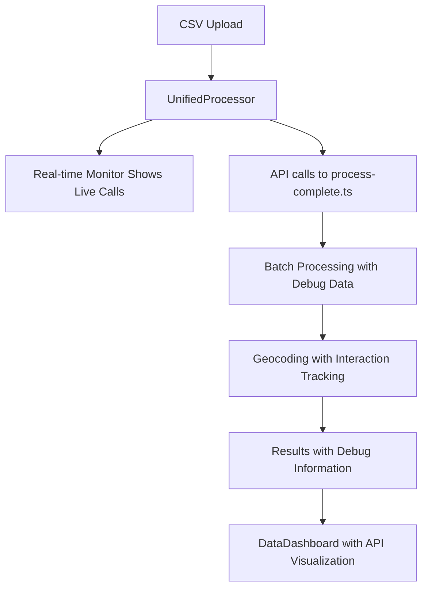

# API Visualization Implementation Guide

## Overview

This implementation provides comprehensive visualization of all OpenAI and Geocoding API requests made during the address processing pipeline. The visualization system includes both real-time monitoring during processing and detailed post-processing analysis.

## Components

### 1. ApiVisualization Component (`/frontend/components/ApiVisualization.tsx`)

**Purpose**: Provides detailed analysis of completed API interactions
**Location**: Integrated as a new tab in the DataDashboard

**Features**:
- **Timeline View**: Chronological view of all API requests
- **OpenAI Batches**: Detailed batch processing information with retry logic
- **Geocoding Details**: Individual geocoding request/response analysis
- **Performance Metrics**: Success rates, response times, and optimization recommendations

**Data Structure**:
```typescript
interface BatchProcessingDebug {
    totalBatches: number
    successfulBatches: number
    failedBatches: number
    batchSize: number
    maxConcurrentBatches: number
    totalProcessingTime: number
    averageTimePerBatch: number
    successRate: number
    batchDetails: BatchDetail[]
}

interface GeocodingInteraction {
    timestamp: string
    rowIndex: number
    request: {
        address: string
        city: string
        state: string
        components: string[]
        url: string
    }
    response: {
        status: string
        results: any[]
        bestResult: any
        rawResponse: any
        responseTime: number
        httpStatus: number | null
        error: string | null
    }
}
```

### 2. RealTimeApiMonitor Component (`/frontend/components/RealTimeApiMonitor.tsx`)

**Purpose**: Live monitoring of API requests during processing
**Location**: Floating overlay during CSV processing

**Features**:
- **Live Updates**: Real-time display of API calls as they happen
- **Status Tracking**: Visual indicators for pending, in-progress, completed, and failed requests
- **Performance Stats**: Running totals and success rates
- **Filtering**: Filter by API type (OpenAI vs Geocoding)
- **Auto-scroll**: Automatically scroll to latest calls

## Integration Points

### 3. DataDashboard Integration

The main dashboard now includes three tabs:
1. **Dashboard**: Original results view
2. **API Visualización**: New comprehensive API analysis
3. **DEBUG**: Original debug information

### 4. Data Flow



## Debug Data Structure

The `/api/process-complete.ts` endpoint now returns enhanced debug information:

```json
{
  "success": true,
  "totalProcessed": 150,
  "statistics": { ... },
  "results": [ ... ],
  "debug": {
    "batchProcessing": {
      "totalBatches": 3,
      "successfulBatches": 3,
      "failedBatches": 0,
      "batchSize": 50,
      "maxConcurrentBatches": 8,
      "totalProcessingTime": 15420,
      "averageTimePerBatch": 5140,
      "successRate": 100,
      "batchDetails": [
        {
          "batchIndex": 0,
          "startRow": 1,
          "endRow": 50,
          "status": "completed",
          "processingTime": 4850,
          "retryCount": 0
        }
      ]
    },
    "geocodingInteractions": [
      {
        "timestamp": "2024-01-15T10:30:45.123Z",
        "rowIndex": 0,
        "request": {
          "address": "Av. Mariscal López 1234",
          "city": "Asunción",
          "state": "Central",
          "components": ["country:PY", "locality:Asunción"],
          "url": "https://maps.googleapis.com/maps/api/geocode/json?..."
        },
        "response": {
          "status": "OK",
          "results": [...],
          "bestResult": {
            "formatted_address": "Av. Mariscal López 1234, Asunción, Paraguay",
            "geometry": {
              "location": { "lat": -25.2637, "lng": -57.5759 },
              "location_type": "ROOFTOP"
            },
            "confidence": 1.0
          },
          "responseTime": 342,
          "httpStatus": 200,
          "error": null
        }
      }
    ]
  }
}
```

## Visualization Features

### Timeline View
- Shows chronological sequence of all API calls
- Visual indicators for different API types
- Status badges (completed, failed, retrying)
- Processing time indicators

### Batch Processing Analysis
- Summary cards with key metrics
- Expandable details for each batch
- Retry information and error details
- Performance timing analysis

### Geocoding Analysis  
- Individual request/response pairs
- Raw Google Maps API responses
- Confidence scoring breakdown
- Error analysis and debugging

### Performance Dashboard
- Success rate comparisons between OpenAI and Geocoding
- Response time analysis
- Processing timeline visualization
- Optimization recommendations

## Benefits

1. **Transparency**: Complete visibility into API interactions
2. **Debugging**: Detailed error information for troubleshooting
3. **Performance**: Response time tracking and optimization insights
4. **Monitoring**: Real-time processing feedback
5. **Analytics**: Success rates and failure pattern analysis

## Usage

1. **During Processing**: Watch the real-time monitor for live updates
2. **After Processing**: Navigate to "API Visualización" tab in results
3. **Debugging**: Use detailed interaction data to troubleshoot issues
4. **Optimization**: Review performance metrics for system improvements

## Real-time Features

- Live API call tracking during processing
- Visual status indicators
- Performance statistics
- Filterable by API type
- Auto-scrolling call log
- Collapsible interface

This implementation provides unprecedented visibility into the API processing pipeline, enabling better debugging, monitoring, and optimization of the geocoding system.
